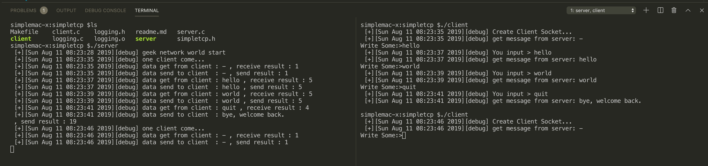

# simpletcp

---

构建一个简单的echo 服务器

## 相关函数介绍

* socket 初始化函数，传递参数 AF_INET, SOCK_STREAM
* 地址格式初始化 sockaddr_in
  * sin_family-> AF_INET
  * sin_port -> htons
  * sin_addr.saddr -> inet_addr()
* bind 绑定socket到服务
* listen 监听地址，传递backlog 为监听队列的长度
* accept 获取客户端的连接，注: 接收连接后，先读取地址
* recv 获取数据， send 发送数据

* Logging 模块，自定义的一个日志输出函数
* strncmp 比较字符串
* simpletcp.h 固定的需要的头文件

